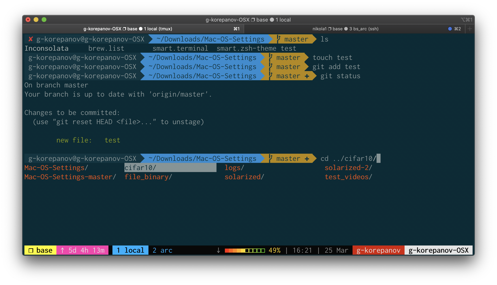

# Mac-OS-Settings
My simple config for quick setup on a Mac OS. 

# Example



## First, install package manager
From [official website](https://brew.sh):
`/bin/bash -c "$(curl -fsSL https://raw.githubusercontent.com/Homebrew/install/HEAD/install.sh)"`

## iTerm2
Download and install [iTerm2](https://iterm2.com). Forget about MacOS default terminal.


## OhMyZsh
Set up [ohmyz.sh](https://ohmyz.sh):

`sh -c "$(curl -fsSL https://raw.githubusercontent.com/ohmyzsh/ohmyzsh/master/tools/install.sh)"`

## Font
Install your favourite font with powerline patch:
https://github.com/powerline/fonts (I love Inconsolata)

## OhMyZsh theme
In `~/.zshrc` change `ZSH_THEME="..."` to `ZSH_THEME="agnoster"`

## iTerm2 preferences
There are some *crucial* settings you will absolutely love in iTerm2:
- [Natural Text Editing](https://gist.github.com/seachai/948ed1eeafa32ce03db6685edb879f71) (enables usual MacOS shortcuts for navigating the command line
- Set Font (which was installed above) and size in (Open Preferences > Profiles > Text)
- Set vertical cursor (Open Preferences > Profiles > Text)
- Know about built-in [tmux integration](https://iterm2.com/documentation-tmux-integration.html) (just use `tmux -CC`)
- Solarized Dark colors (Open Preferences > Profiles > Colors > Color Presets... > Solarized Dark)
- iTerm2 > Install [Shell integration](https://iterm2.com/documentation-shell-integration.html). When shell integration is enabled, iTerm2 automatically adds a mark at each command prompt. You can navigate marks with Cmd-Shift-Up and Down-arrow keys.
- tmux settings:


## vim config
`curl https://raw.githubusercontent.com/gkorepanov/Mac-OS-Settings/master/.vimrc -o ~/.vimrc`


# Work in progress

## Useful link
https://gitlab.com/gnachman/iterm2/-/wikis/tmux-Integration-Best-Practices

## Eternal Terminal
`brew install MisterTea/et/et`

## Now, you want to bring all that stuff to any SSH host, right?
`brew install xxh`

```
xxh +I xxh-plugin-prerun-core
xxh +I xxh-shell-zsh
xxh +I xxh-plugin-prerun-dotfiles
xxh +I xxh-plugin-zsh-ohmyzsh
```

Now just use 
`xxh +s zsh +if <my_server>` instead `ssh <my_server>`


## Other useful tools
- https://github.com/ajeetdsouza/zoxide
- https://github.com/junegunn/fzf
